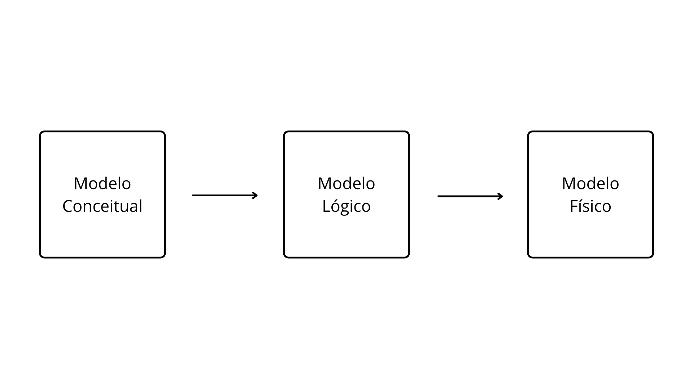
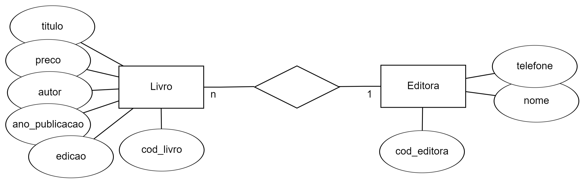
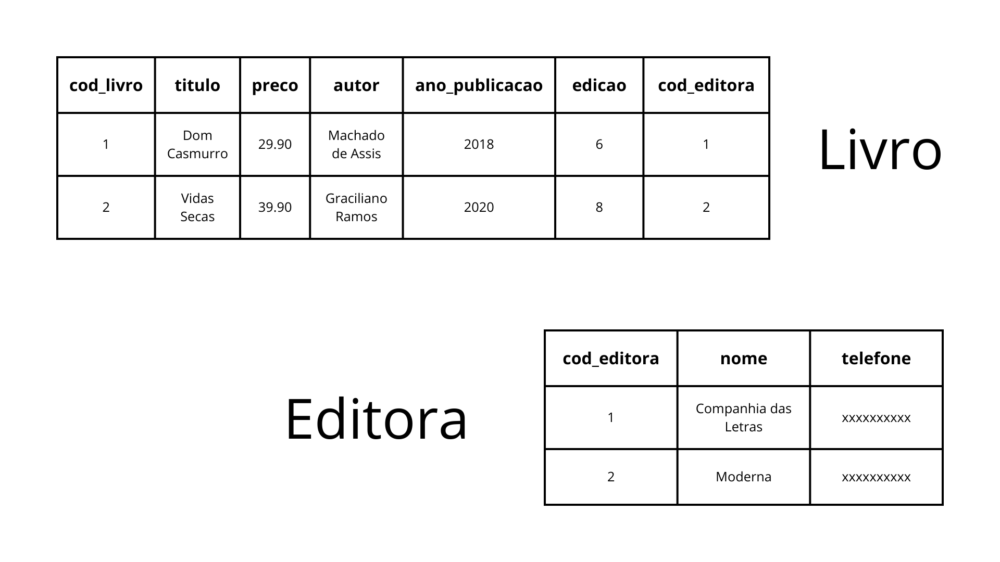

# 1. Projeto de Banco de Dados

O projeto de um banco de dados é um processo que pode ser dividido em três etapas principais, cada uma desempenhando um papel crucial na organização e eficiência do sistema. A primeira etapa, a modelagem conceitual, tem como objetivo capturar formalmente os requisitos de informação, assegurando que o banco de dados atenda às necessidades identificadas. Na segunda etapa, o projeto lógico, as estruturas de dados são definidas em nível de Sistema de Gerenciamento de Banco de Dados (SGBD), com base nos requisitos previamente modelados. Por fim, a etapa de projeto físico visa otimizar a performance do sistema por meio da definição de parâmetros físicos de acesso ao banco de dados.

Um projeto bem estruturado é essencial para garantir a organização eficiente das informações, contribuindo para a obtenção de boa performance e facilitando as manutenções futuras do sistema. A utilização de técnicas apropriadas durante todas as etapas do projeto possibilita a construção de um banco de dados robusto e de fácil gerenciamento. A figura 1.2 a seguir ilustra as três etapas do projeto de banco de dados.

<div align="center">
    
    <p>Figura 1.2: Etapas do projeto de banco de dados.</p>
</div>

## 1.1. Modelo Conceitual

O modelo conceitual é uma etapa essencial no desenvolvimento de um banco de dados eficiente e organizado. Ele consiste em representar a estrutura dos dados de forma abstrata, sem incluir detalhes específicos de implementação em um Sistema de Gerenciamento de Banco de Dados (SGBD). Durante esse processo, são identificadas as entidades relevantes, seus atributos e os relacionamentos entre elas, determinando quais dados serão incluídos no banco de dados. Embora o modelo conceitual descreva as informações que devem ser armazenadas, ele não define como esses dados serão fisicamente organizados ou gerenciados no nível do SGBD.

A técnica mais amplamente utilizada para modelagem conceitual é a abordagem Entidade-Relacionamento (ER), que geralmente é representada por um Diagrama Entidade-Relacionamento (DER). Esse diagrama oferece uma visão clara das entidades e suas inter-relações. A Figura 1.3, por exemplo, apresenta um DER parcial de um sistema de biblioteca.

<div align="center">
    
    <p>Figura 1.3: Exemplo de modelo conceitual.</p>
</div>

## 1.2. Modelo Lógico

O modelo lógico de um banco de dados descreve a estrutura e as relações entre os dados em um nível de abstração, focando na organização das entidades e suas interações dentro de um Sistema de Gerenciamento de Banco de Dados (SGBD). Ele é dependente do tipo de SGBD utilizado, como o relacional, no qual os dados são organizados em tabelas. Embora seja uma representação abstrata, o modelo lógico define quais tabelas compõem o banco de dados e, para cada uma, especifica os nomes das colunas e suas respectivas características. A Figura 1.4 ilustra um exemplo de banco de dados relacional projetado a partir do modelo conceitual apresentado na Figura 1.3.

<div align="center">
    
    <p>Figura 1.4: Exemplo de modelo lógico.</p>
</div>

Esse modelo demonstra que o banco de dados contém informações sobre livros e editoras. Para cada livro, são armazenados dados como código, título, preço, autor, ano de publicação, edição e a editora associada. Para cada editora, o banco de dados registra o código, nome, telefone e os livros vinculados a ela.

## 1.3. Modelo Físico

O modelo físico de um banco de dados corresponde à sua implementação real em um Sistema de Gerenciamento de Banco de Dados (SGBD), contemplando especificações técnicas como tipos de dados, índices, partições e o armazenamento dos dados no disco. Abaixo, segue um exemplo de script em PostgreSQL, baseado no modelo lógico da Figura 1.4:

```
/* Criar tabela editora */
CREATE TABLE editora (
    cod_editora SERIAL PRIMARY KEY,
    nome VARCHAR(50) NOT NULL,
    telefone VARCHAR(15)
);

/* Criar tabela livro */
CREATE TABLE livro (
    cod_livro SERIAL PRIMARY KEY,
    titulo VARCHAR(50) NOT NULL,
    preco DECIMAL(10, 2) NOT NULL,
    autor VARCHAR(50) NOT NULL,
    ano_publicacao DATE,
    edicao INTERGER,
    cod_editora INTEGER,
    FOREIGN KEY (cod_editora) REFERENCES editora(cod_editora)
);
```

A modelagem conceitual, lógica e física são etapas essenciais no desenvolvimento de um projeto de banco de dados eficiente e confiável. Seguir essas etapas garante a organização e a segurança dos dados, melhora a qualidade do sistema e otimiza seu desempenho.