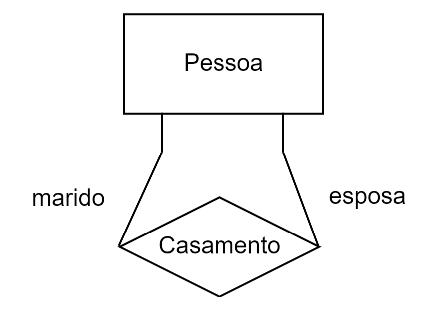
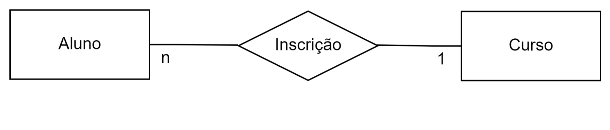
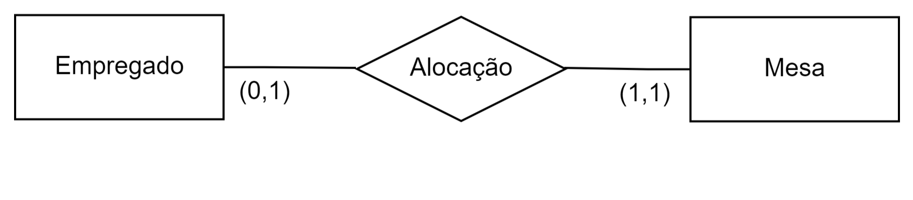
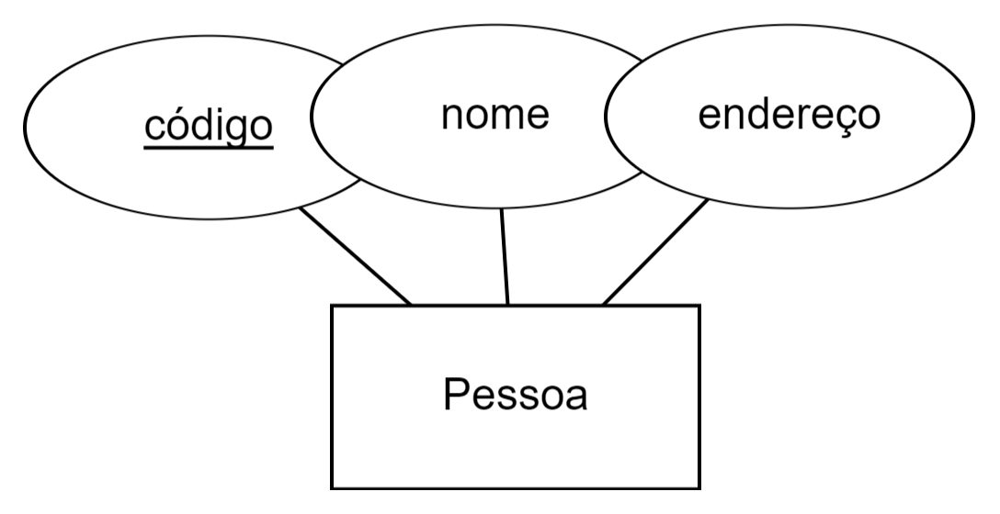
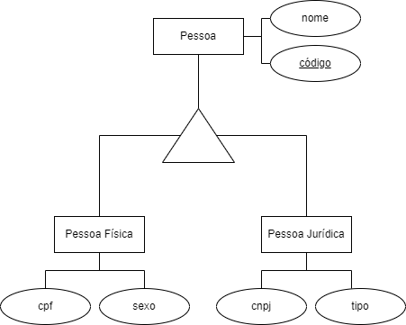
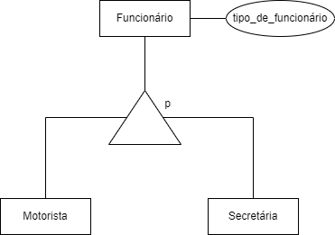
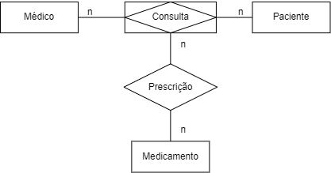
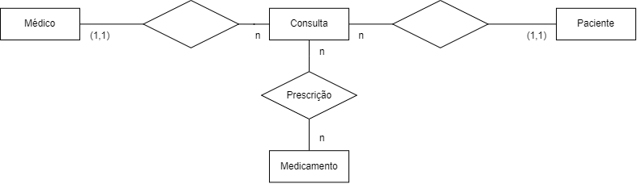

# 2. Entidade-Relacionamento (ER)

A abordagem mais amplamente utilizada para modelagem de dados é a técnica de entidade-relacionamento (ER). Nessa técnica, o modelo de dados é representado por um modelo entidade-relacionamento (ER), que geralmente é ilustrado por meio de um diagrama de entidade-relacionamento (DER).

## 2.1. Entidade

Em um modelo entidade-relacionamento (ER), uma entidade representa um conjunto de objetos ou elementos da realidade que possuem características em comum e que são relevantes para o sistema de informação que está sendo modelado. O foco é apenas nos objetos que precisam ser representados no banco de dados, ou seja, aqueles que possuem informações importantes para o contexto da aplicação.

Em um DER, uma entidade é representada por um retângulo que contém seu nome, conforme ilustrado na figura 2.1.

    
    
Figura 2.1: Representação gráfica de entidades.

No exemplo, o primeiro retângulo representa o conjunto de todas as pessoas sobre as quais se deseja armazenar informações no banco de dados, enquanto o segundo retângulo corresponde ao conjunto de todos os departamentos sobre os quais se deseja manter informações

## 2.2. Relacionamento

Os relacionamentos entre entidades em um banco de dados refletem as associações e interações lógicas entre diferentes entidades. Eles são estabelecidos para modelar as conexões que existem no mundo real, garantindo a integridade e a consistência dos dados armazenados.

Em um Diagrama Entidade-Relacionamento (DER), os relacionamentos são representados por losangos conectados por linhas aos retângulos que simbolizam as entidades envolvidas. A Figura 2.2 ilustra um DER com duas entidades, Pessoa e Departamento, e um relacionamento denominado Lotação.

    
    
Figura 2.2: Representação gráfica de relacionamento.

No exemplo, o relacionamento Lotação representa uma associação específica, formada por uma associação entre uma instância da entidade Pessoa e uma instância da entidade Departamento.

### 2.2.1. Auto-relacionamento

Auto-relacionamento é uma associação entre registros de uma mesma entidade. Nesse caso, é necessário introduzir o conceito de papel da entidade no relacionamento. Por exemplo, em um relacionamento de casamento, um registro da entidade Pessoa assume o papel de marido, enquanto outro registro assume o papel de esposa. Os papéis são indicados no DER, conforme ilustrado na Figura 2.3.

    
    
Figura 2.3: Representação gráfica de auto-relacionamento.

## 2.3. Cardinalidade

Para o projeto de banco de dados, uma característica importante de um relacionamento é o número de registros de uma entidade que podem ser associados a um registro específico de outra entidade por meio do relacionamento. Essa característica é conhecida como cardinalidade do relacionamento. Existem dois tipos de cardinalidade a considerar: a cardinalidade máxima e a cardinalidade mínima.

### 2.3.1. Cardinalidade Máxima

A Cardinalidade Máxima refere-se ao número máximo de vezes que uma entidade A pode estar associada a uma entidade B. Esse valor pode ser 1, indicando uma única associação, ou N, quando múltiplas associações são permitidas.

No Diagrama Entidade-Relacionamento (DER), a cardinalidade máxima é representada conforme mostrado na Figura 2.4. Embora a convenção possa inicialmente parecer contraintuitiva, ela é anotada no lado oposto ao relacionamento ao qual se refere. Por exemplo, a cardinalidade máxima da entidade Eempregado no relacionamento Lotação é indicada junto ao símbolo da entidade Departamento.

    
    
Figura 2.4: Cardinalidade máxima de relacionamento.

De acordo com a Figura 2.4, pode-se observar que:

- Uma ocorrência da entidade Empregado pode estar associada, no máximo, uma ocorrência de Departamento (localizada no lado oposto da anotação).

- Uma ocorrência da entidade Departamento podem estar associadas várias ocorrências de Empregado (localizada no lado oposto da anotação).

### 2.3.2. Classificação de Relacionamentos Binários

A cardinalidade máxima é utilizada para classificar relacionamentos binários, que envolvem duas entidades. Esses relacionamentos podem ser categorizados como muitos-para-muitos (n:n), um-para-muitos (1:n) ou um-para-um (1:1). O que determina o fato de o relacionamento ser binário é o número de ocorrências de entidade que participam de cada ocorrência do relacionamento. As Figuras 2.5, 2.6 e 2.7 a seguir ilustram as diferentes formas de relacionamentos binários.

    
    
Figura 2.5: Relacionamento 1:1.

    
    
Figura 2.6: Relacionamento 1:n.

    
    
Figura 2.7: Relacionamento n:n.

### 2.3.3. Relacionamento Ternário

Em um relacionamento ternário, a cardinalidade refere-se a pares de entidades. Em um relacionamento R envolvendo três entidades A, B e C, a cardinalidade máxima entre A e B em R indica quantas ocorrências de C podem estar associadas a um par de ocorrências de A e B.

No exemplo do relacionamento Distribuição, figura 2.8, cada ocorrência associa três entidades: um produto a ser distribuído, uma cidade onde ocorre a distribuição e um distribuidor.

    
    
Figura 2.8: Cardinalidade em relacionamentos ternários.

A cardinalidade "1" refere-se ao par cidade e produto, indicando que cada combinação de cidade e produto está associada a, no máximo, um distribuidor, ou seja, não há concorrência na distribuição de um produto em uma cidade.

Para o par cidade e distribuidor, podem estar associados vários produtos, ou seja, um distribuidor pode distribuir muitos produtos em uma cidade.

Para o par produto e distribuidor, podem estar associadas várias cidades, ou seja, um distribuidor pode distribuir um produto em diversas cidade

### 2.3.4. Cardinalidade Mínima

Além da cardinalidade máxima, o modelo ER também pode representar o número mínimo de ocorrências de uma entidade associadas a outra entidade por meio de um relacionamento. Para fins de projeto de banco de dados, considera-se apenas duas cardinalidades mínimas: 0 e 1.

A cardinalidade mínima 1, também conhecida como "associação obrigatória", indica que o relacionamento deve necessariamente associar uma ocorrência de entidade a cada ocorrência da outra entidade. Por outro lado, a cardinalidade mínima 0, chamada "associação opcional", indica que a associação não é obrigatória.

A cardinalidade mínima é representada junto à cardinalidade máxima no diagrama, como mostrado na Figura 2.9. Nesse exemplo, relacionado à alocação de empregados a mesas, a cardinalidade mínima especifica que cada empregado deve obrigatoriamente ter uma mesa alocada a ele (cardinalidade mínima 1), enquanto uma mesa pode existir sem estar alocada a um empregado (cardinalidade mínima 0).

    
    
Figura 2.9: Cardinalidade mínima de relacionamento.

## 2.4. Atributo

Para associar informações a ocorrências de entidades ou relacionamentos, utiliza-se o conceito de atributo. Um atributo é um dado associado a cada ocorrência de uma entidade ou relacionamento.

Graficamente, os atributos são representados conforme ilustrado na Figura 2.10. A figura mostra que, para cada ocorrência da entidade Projeto, são associados exatamente um código, um nome e um tipo.

    
    
Figura 2.10: Atributos de uma entidade.

Assim como as entidades, os relacionamentos também podem possuir atributos. A Figura 2.11 ilustra um Diagrama Entidade-Relacionamento (DER) em que o relacionamento Atuação tem um atributo que representa a função que um engenheiro exerce dentro de um projeto. Esse atributo não pode ser considerado parte da entidade Engenheiro, pois um engenheiro pode atuar em diversos projetos exercendo diferentes funções. Da mesma forma, não pode ser atribuído à entidade Projeto, uma vez que em um projeto podem atuar vários engenheiros com funções distintas.

    
    
Figura 2.11: Atributo de relacionamento.

### 2.4.1. Identificando Entidades

Cada entidade deve possuir um identificador, que é um conjunto de um ou mais atributos cujos valores servem para distinguir uma ocorrência da entidade das demais ocorrências.

O caso mais simples é aquele em que a entidade possui um único atributo como identificador. No Diagrama Entidade-Relacionamento (DER), os atributos identificadores são representados por um sublinhado. No exemplo da Figura 2.12, o atributo código é o identificador, indicando que cada pessoa possui um código único. Por outro lado, os atributos nome e endereço não são identificadores, pois o mesmo nome ou endereço pode ser associado a diferentes pessoas.

    
    
Figura 2.12: Identificando entidade.

## 2.5. Generalização 

Além de relacionamentos e atributos, propriedades podem ser atribuídas a entidades por meio do conceito de generalização/especialização. Esse conceito permite atribuir propriedades específicas a um subconjunto especializado de uma entidade genérica. A representação gráfica da generalização/especialização é um triângulo isósceles, como ilustrado na Figura 2.13. Nesse exemplo, a entidade PESSOA é subdividida em dois subconjuntos: PESSOA FÍSICA e PESSOA JURÍDICA, cada um com suas propriedades particulares.

A generalização/especialização também envolve o conceito de herança de propriedades. Isso significa que cada ocorrência da entidade especializada herda, além de suas próprias propriedades (atributos, relacionamentos e generalizações/especializações), as propriedades da entidade genérica correspondente. No DER da Figura 2.13, por exemplo, a entidade PESSOA FÍSICA possui, além de seus atributos específicos (cpf e sexo), todas as propriedades da entidade PESSOA, como os atributos nome e código, sendo identificada pelo atributo código. Da mesma forma, a entidade PESSOA JURÍDICA possui os atributos nome, código, cnpj e tipo de organização, e também é identificada pelo atributo código.

Em resumo, o diagrama expressa que toda PESSOA FÍSICA tem como atributos nome, código, cpf e sexo, e é identificada pelo código. De maneira análoga, toda PESSOA JURÍDICA tem como atributos nome, código, cnpj e tipo de organização, sendo igualmente identificada pelo código.

    
    
Figura 2.13: Generalização/especialização.

A generalização/especialização pode ser classificada em dois tipos: total (t) ou parcial (p), dependendo da obrigatoriedade de uma ocorrência da entidade genérica estar associada a uma ocorrência da entidade especializada.

Na generalização/especialização total, para cada ocorrência da entidade genérica, sempre existe uma correspondência em uma das entidades especializadas. Por exemplo, conforme a Figura 2.13, toda ocorrência da entidade PESSOA está associada a uma ocorrência em uma das especializações, seja PESSOA FÍSICA ou PESSOA JURÍDICA.

Na generalização/especialização parcial, nem toda ocorrência da entidade genérica está associada a uma ocorrência em uma das entidades especializadas. No exemplo da Figura 2.14, nem todos os funcionários são motoristas ou secretárias, o que caracteriza a especialização parcial.

Nesses casos, costuma-se incluir um atributo na entidade genérica que identifica o tipo de ocorrência. No exemplo citado, o atributo seria tipo de funcionário. Esse atributo não é necessário em especializações totais, uma vez que a própria existência da entidade em uma das especializações já define seu tipo.

    
    
Figura 2.14: Generalização/especialização parcial.

## 2.6. Entidade Associativa

As entidades associativas são essenciais na modelagem de dados, especialmente em cenários que envolvem relacionamentos complexos, como os muitos-para-muitos. Essas entidades intermediárias são usadas para simplificar a estrutura do banco de dados e, ao mesmo tempo, permitir o armazenamento de informações adicionais sobre a relação entre outras entidades.

Em vez de tratar o relacionamento como uma simples associação entre entidades, ele é transformado em uma entidade própria, com seus próprios atributos. Isso é especialmente útil quando há a necessidade de registrar detalhes específicos sobre a relação, além dos dados pertencentes às entidades principais.

Na Figura 2.15, por exemplo, o relacionamento CONSULTA é representado graficamente como uma entidade associativa, indicada pelo retângulo ao redor do relacionamento. Assim, CONSULTA passa a ser tratada como uma entidade e pode, por sua vez, se relacionar com outras entidades, como MEDICAMENTO.

    
    
Figura 2.15: Entidade associativa.

Caso o conceito de entidade associativa não fosse utilizado, seria necessário transformar o relacionamento CONSULTA em uma entidade, para que pudesse ser relacionada a MEDICAMENTO, conforme ilustrado na Figura 2.16.

    
    
Figura 2.16: Substituindo relacionamento por entidade.

Observa-se que, para manter a equivalência com o diagrama anterior, uma consulta está relacionada a exatamente um médico e um paciente (com cardinalidade mínima e máxima igual a 1). Isso significa que uma consulta é identificada de maneira única pelo médico e paciente a ela associados. Ao substituir o relacionamento CONSULTA por uma entidade, torna-se possível relacionar essa nova entidade com a entidade MEDICAMENTO.

Vale destacar que o diagrama da Figura 2.16 é equivalente ao da Figura 2.15, no sentido de que ambos resultam na criação do mesmo esquema de banco de dados relacional. A equivalência aqui refere-se à preservação da integridade e da estrutura de dados, mesmo que a representação gráfica tenha sido modificada.