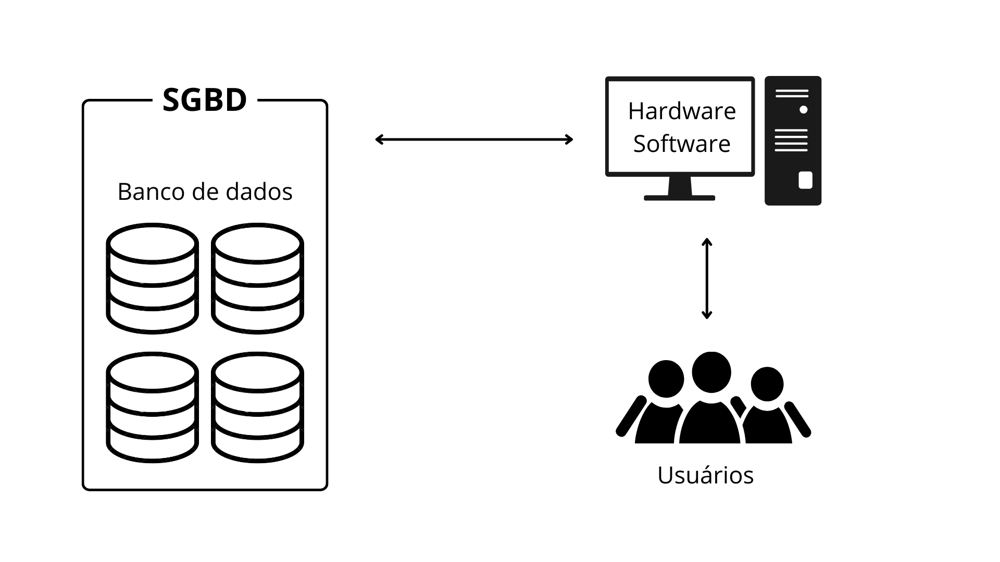

# Introdução

Um banco de dados é uma coleção organizada de informações, ou dados, estruturadas e armazenadas eletronicamente em um sistema de computador, geralmente sob o controle de um sistema de gerenciamento de banco de dados (SGBD).

O SGBD é um software responsável pela manipulação e gerenciamento dos dados, permitindo a interação do usuário com o banco de dados. Entre os exemplos mais conhecidos de SGBDs estão Oracle, SQL Server, PostgreSQL, MySQL, entre outros. O principal objetivo de um sistema de banco de dados é abstrair os detalhes internos do armazenamento e acesso aos dados, proporcionando independência dos dados em relação às aplicações.

Nos tipos mais comuns de bancos de dados em uso atualmente, as informações são organizadas em linhas e colunas de tabelas, facilitando o processamento e a consulta. A maioria desses bancos utiliza a linguagem de consulta estruturada (SQL) para manipulação e consulta de dados.

A Figura 1.1 abaixo ilustra um sistema de banco de dados, composto por dados, hardware, software e usuários. Observa-se que o SGBD é responsável pelo gerenciamento do banco de dados.

    
    
Figura 1.1: Sistema de banco de dados.

